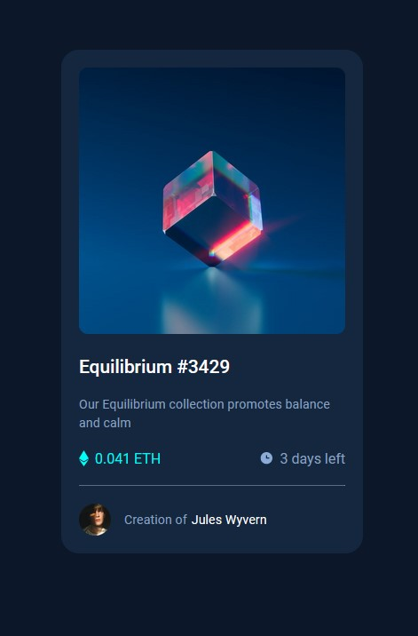
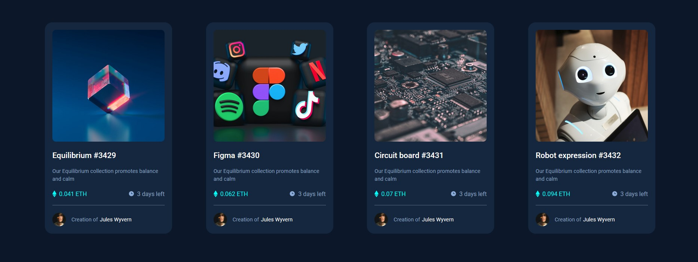
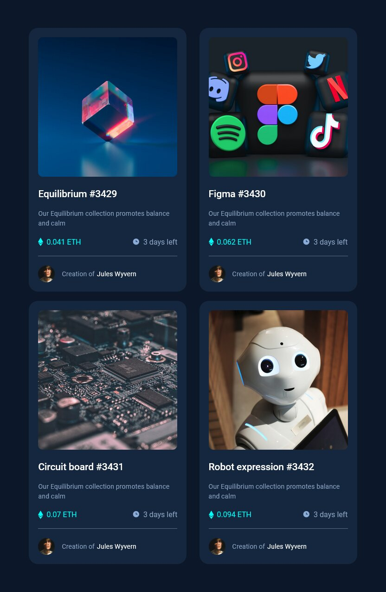
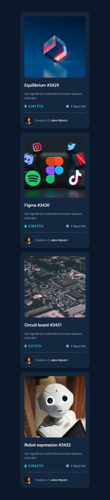

# Frontend Mentor - NFT preview card component solution

This is a solution to the [NFT preview card component challenge on Frontend Mentor](https://www.frontendmentor.io/challenges/nft-preview-card-component-SbdUL_w0U). Frontend Mentor challenges help you improve your coding skills by building realistic projects. 

## Table of contents

- [Overview](#overview)
  - [The challenge](#the-challenge)
  - [Screenshot](#screenshot)
  - [Links](#links)
- [My process](#my-process)
  - [Built with](#built-with)
  - [What I learned](#what-i-learned)
  - [Continued development](#continued-development)
  - [Useful resources](#useful-resources)
- [Author](#author)


## Overview

### The challenge

Users should be able to:

- View the optimal layout depending on their device's screen size
- See hover states for interactive elements

### Screenshot


```Desktop
```
[Desktop]- Desktop





### Links

- Solution URL: [Add solution URL here](https://your-solution-url.com)
- Live Site URL: [Add live site URL here](https://your-live-site-url.com)

## My process

### Built with

- Semantic HTML5 markup
- CSS custom properties
- Flexbox


### What I learned

Use this section to recap over some of your major learnings while working through this project. Writing these out and providing code samples of areas you want to highlight is a great way to reinforce your own knowledge.

To see how you can add code snippets, see below:

```html
<h1>Some HTML code I'm proud of</h1>
```
```css
.proud-of-this-css {
  color: papayawhip;
}
```


### Continued development

Using flexbox was not so easy to start with, since I'm still new with this concept. I'll be focusing on this subject for the comming challenges.


### Useful resources

- [CSS-Tricks](https://css-tricks.com/snippets/css/a-guide-to-flexbox/) - This is an amazing article which helped me getting started with flexbox. I'd recommend it to anyone still learning this concept.
- [Colt Steele - Flexbox tutorial](https://www.youtube.com/watch?v=qZv-rNx0jEA) - This video helped me understan flexbox. This tutorial is very easy to follow and understand.


## Author

- Website - [Add your name here](https://www.your-site.com)
- Frontend Mentor - [@hitmorecode](https://www.frontendmentor.io/profile/hitmorecode)